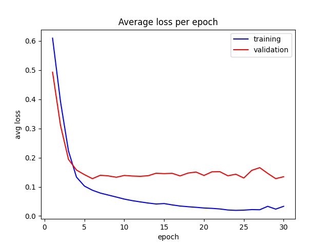

# EEGformer: A transformer–based brain activity classification method using EEG signal
### Zhijiang Wan, Manyu Li, Shichang Liu, Jiajin Huang, Hai Tan, Wenfeng Duan
Unofficial implementation of [EEGformer](https://doi.org/10.3389/fnins.2023.1148855).


## Test outputs
Test for binary classification was held using dataset from [harunshimanto/epileptic-seizure-recognition](https://www.kaggle.com/datasets/harunshimanto/epileptic-seizure-recognition).
```
>>> b 1 -> loss : 0.10704212635755539
>>> b 2 -> loss : 0.1002800315618515
>>> b 3 -> loss : 0.09817875921726227
>>> b 4 -> loss : 0.08052875846624374
>>> b 5 -> loss : 0.0640881359577179
>>> b 6 -> loss : 0.07361496239900589
>>> b 7 -> loss : 0.06537295132875443
>>> b 8 -> loss : 0.041959475725889206
>>> b 9 -> loss : 0.2446010261774063
>>> b 10 -> loss : 0.17596574127674103
>>> b 11 -> loss : 0.07324836403131485
>>> b 12 -> loss : 0.07986347377300262
>>> b 13 -> loss : 0.06936746835708618
>>> b 14 -> loss : 0.10445424169301987
acc = 0.906
sen = 0.16666666666666666
spe = 0.9149797570850202
>>> epoch 30 -> tp : 2, fp : 84, tn : 904, fn : 10
```

