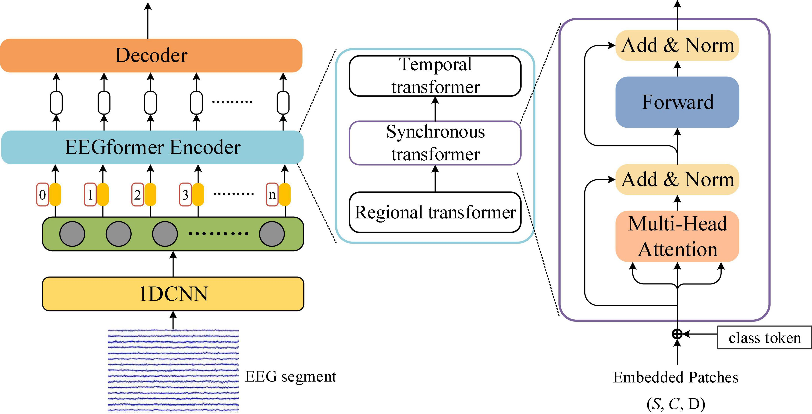
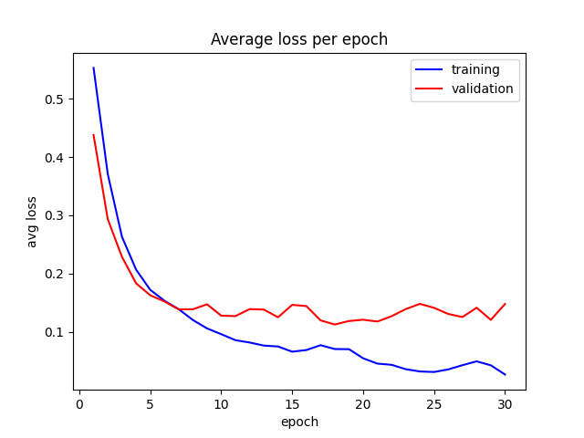

# EEGformer: A transformer–based brain activity classification method using EEG signal
### Zhijiang Wan, Manyu Li, Shichang Liu, Jiajin Huang, Hai Tan, Wenfeng Duan
Unofficial implementation of [EEGformer](https://doi.org/10.3389/fnins.2023.1148855).



## Test outputs
Simple test for binary classification was held using dataset from [harunshimanto/epileptic-seizure-recognition](https://www.kaggle.com/datasets/harunshimanto/epileptic-seizure-recognition).
```
>>> b 1 -> loss : 0.01655109040439129
>>> b 2 -> loss : 0.031279515475034714
>>> b 3 -> loss : 0.04392441734671593
>>> b 4 -> loss : 0.05442216247320175
>>> b 5 -> loss : 0.03752667456865311
>>> b 6 -> loss : 0.020403176546096802
>>> b 7 -> loss : 0.011770806275308132
>>> b 8 -> loss : 0.0071481978520751
>>> b 9 -> loss : 0.010197133757174015
>>> b 10 -> loss : 0.055636290460824966
>>> b 11 -> loss : 0.07113715261220932
>>> b 12 -> loss : 0.06072484701871872
>>> b 13 -> loss : 0.025393614545464516
>>> b 14 -> loss : 0.019941965118050575
acc = 0.957
sen = 0.95
spe = 0.95875
>>> epoch 30 -> tp : 190, fp : 33, tn : 767, fn : 10
```
